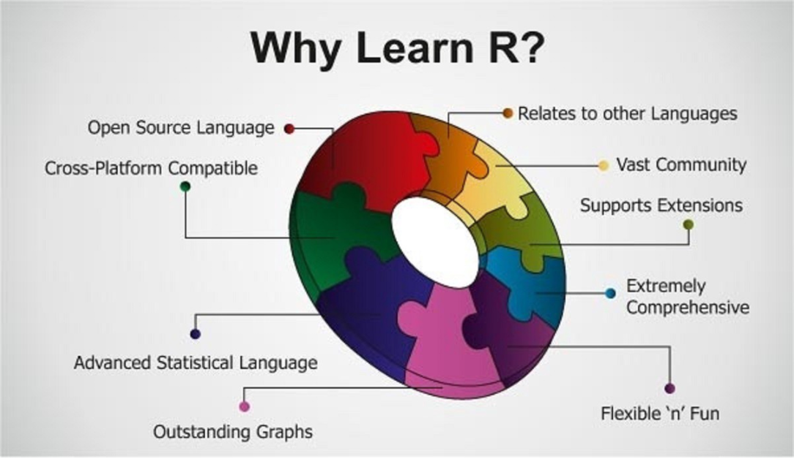

```{r setup, include=FALSE}
knitr::opts_chunk$set(echo = F,
                      message = F,
                      warning = F,
                      comment = "")
```

## What is **R**?

- Software environment for data analysis, statistical computing, and graphics
- Statistical Programming language with a natural ease of use. Permits creating simple and complex functions/programs to execute various tasks

Beyond the scope, there is a lot more things you can do with R.

R originated from the statistical programming language S which was developed by John Chambers in the 1970’s

The 1st ever R version was developed by Robert Gentlemen and Rose Ihaka at the university of Auckland in the 1990’s

## Why should I learn **R**?(1/2)
```{r why R, out.width="100%",fig.align='center',out.height="80%"}
library(knitr)

```

## Why should I learn **R**?(2/2)
There are many choices for data analysis software

- SAS, Stata, SPSS, Excel, MATLAB, Minitab, pandas
- So why are we using R?
R is a fantastic tool for data manipulation and grapical display.

- You can implement any kind of method in R (power of flexibility)

- Supports interactive reproducibale research (R-markdown and Shiny applications)

- It's cross-platform and supports various operating systems

- It's extensible with over 5,000 libraries which are also free to download 


- ... endless reasons to learn R and everything about **R** is open-source

Data handling in R is easy and effective and there exists alot of inbuilt base functions (both for simple operations to complex procedures)

## What is Rstudio and how different is it from R?
**Rstudio** is a free open source IDE(integrated development environment) for R. You **MUST** have **R** installed before you can use RStudio.

It's an interface that is well organized so that the user can clearly view graphs, data tables, R code, and output all at the same time as compared to typical R GUI (Graphics User Interface).

In this course, we are going to use Rstudio to demonstrate all practicals, but we will briefly look at R GUI and how its different from R studio.
Want to know more about Rstudio, check the reference material *`Getting_Started_with_Rstudio.pdf`* for more details


## The R syntax
The R syntax is easy to use and understand. We just need to type commands afte the ">" sign in the console.
It is worth to NOTE that R is case sensitive, capital and small letters  represent different objects.

The syntax is classified into:-

- **_expressions_**: they are just evaluated, printed, and the value is
then lost.

- **_assignments_**: an `expression` is evaluated, its value is not
printed but assigned to an object, which is automatically
saved in the `workspace`.


## R Objects
We can assign espressions to objects. The objects can be of several forms i.e. arrays of numbers, characters, functions, strings etc.

When a value is assigned to an object, its stored with its unique name and the resulting collection of objects is called 
**Workspace**

We can check which objects we have in our workspace using the command **`(ls())`** and
we can delete objects as well using the command **`(rm(objectname))`**

Types of R objects:-

- Vectors(basic data structure in R)
    - atomic vectors (logical,interger,double/numeric and character)
    - lists
  
- Matrices
- Dataframes


## R Resources

- Official page: http://www.r-project.org
- Download page: http://www.cran.r-project.org

Some helpful websites:

- http://www.statmethods.net
- www.rseek.org
- http://www.ats.ucla.edu/stat/r/
- http://finzi.psych.upenn.edu/search.html

Looking for a command? Google it. The best way to learn R is through trial and error


